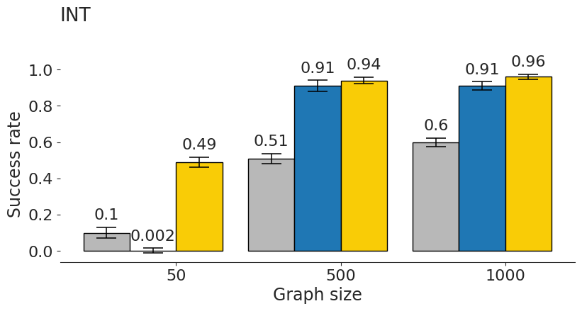
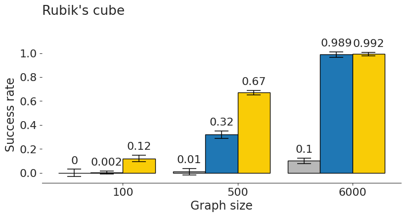
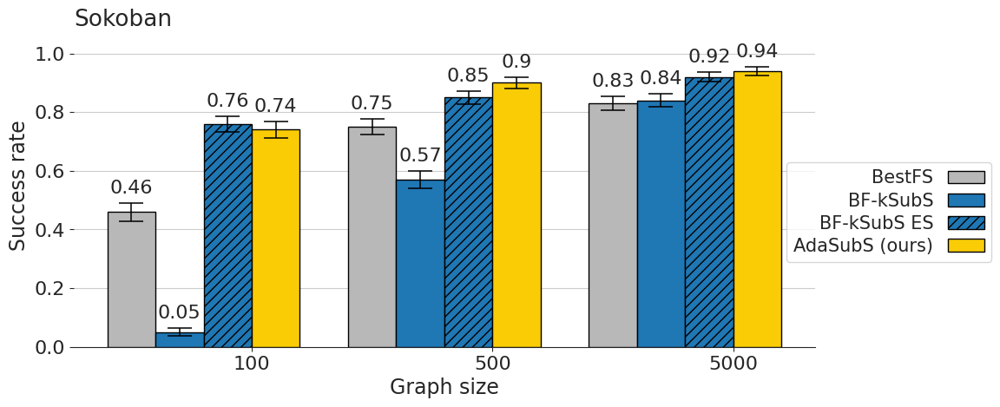

# Fast and Precise: Adjusting Planning Horizon with Adaptive Subgoal Search

# Requirements

## Source code

Clone the repository:
```
git clone https://github.com/AdaptiveSubgoalSearch/adaptive_subs.git
```
All commands from sections *Training* and *Evaluation* should be called from the root directory of the repository.

## Project resources

Download and unzip Google Drive directory containing all project resources:
[link](https://drive.google.com/drive/folders/1k6o3CrDBUPdOa0nRWi6HaNmjOjqakkGi?usp=sharing).
You can do it via Google's graphical interface or using [gdrive](https://github.com/prasmussen/gdrive) CLI tool.

It is recommended to set environmental variable `KSUBS_RESOURCES` to the path with unzipped directory:
```
export KSUBS_RESOURCES="/path/to/the/root/dir/of/resources"
```
which is frequently used in commands below (alternatively you may replace it on your own for each command separately).

Resources include:
* Singularity image
* Pretrained network checkpoints
* Datasets for Sokoban

## Dependencies

### Singularity (recommended)

Python interpreter and all required libraries are installed in the singularity image &ndash; `singularity_image.sif` file in resources directory. It is the easiest and recommended way of environment setup. [Singularity](https://sylabs.io/docs/) is a docker-like container platform, commonly supported in computing centers. You can also install it on your own machine if needed &ndash; see linked documentation. 

Alternatively, one can also build mentioned singularity image from scratch using `singularity.def` file from this repository (it may take a while - around 30-60 min).
```
sudo singularity build singularity_image.sif singularity.def
```

To run a command from *Training* or *Evaluation* section inside a singularity container, prepend the command with the following prefix:
```
singularity exec -B "${KSUBS_RESOURCES}" --nv "${KSUBS_RESOURCES}/singularity_image.sif"
```
So for example to run Rubik's Cube baseline evaluation, you need to run the following command:
```
singularity exec -B "${KSUBS_RESOURCES}" --nv "${KSUBS_RESOURCES}/singularity_image.sif" \
python3 runner.py \
--config_file="configs/rubik/solve/baseline.gin" \
--config="ValueEstimatorRubik.checkpoint_path=\"${KSUBS_RESOURCES}/rubik/value\"" \
--config="VanillaPolicyRubik.checkpoint_path=\"${KSUBS_RESOURCES}/rubik/vanilla_policy\""
```

### Virtualenv/conda (fall-back option)

If singularity is not an option in your computing setup, you may use classic virtualenv or conda environment instead. Just create environment with Python 3.6.9 and install required dependencies:
```
pip3 install -r requirements.txt -f https://download.pytorch.org/whl/torch_stable.html
```
Libraries and versions specified in `requirements.txt` match their counterparts from singularity image. Everything should work as with singularity image, but bear in mind that most of the commands were tested in singularity setup and virtualenv/conda setup is only a fall-back option.


# Training

To train models mentioned in the paper, use the commands listed below.


## INT

Subgoal generator (k = 3) <br>
Requires: 16GB RAM, 1 GPU.

`k` is configurable with `extract_state_pairs.subgoal_distance` parameter.

```
python3 runner.py \
--config_file="configs/int/train/proof_len_15/ksubs/subgoal_generator.gin"
--config="extract_state_pairs.subgoal_distance=3"
```

Conditional policy <br>
Requires: 16GB RAM, 1 GPU.
```
python3 runner.py \
--config_file="configs/int/train/proof_len_15/ksubs/conditional_policy.gin"
```

Policy <br>
Requires: 16GB RAM, 1GPU.
```
python3 runner.py \
--config_file="configs/int/train/proof_len_15/baseline/policy.gin"
```

Value network <br>
Requires: 16GB RAM, 1GPU.
```
python3 runner.py \
--config_file="configs/int/train/proof_len_15/value.gin"
```


## Sokoban

Subgoal generator (k = 8)
Requires: 120GB RAM, 28 CPU.

`k` is configurable with `JobTrainSokobanPixelDiff.steps_into_future` parameter.

```
python3 runner.py \
--config_file="configs/sokoban/train/subgoal_generator.gin" \
--config="JobTrainSokobanPixelDiff.dataset=\"${KSUBS_RESOURCES}/sokoban/datasets/12-12-4/\"" \
--config="JobTrainSokobanPixelDiff.steps_into_future=8"
```

Baseline policy
Requires: 120GB RAM, 28 CPU.

You can change size of the board with `JobTrainSokobanPixelDiff.dataset` parameter.

```
python3 runner.py \
--config_file="configs/sokoban/train/policy.gin" \
--config="JobSokobanTrainPolicyBaseline.dataset=\"${KSUBS_RESOURCES}/sokoban/datasets/12-12-4/\""
```


# Rubik

Subgoal generator (k = 4) <br>
Requires: 10GB RAM, 1 GPU.

`k` is configurable with `generate_subgoal_learning_data.distances` parameter.

```
python3 runner.py \
--config_file="configs/rubik/train/ksubs/subgoal_generator.gin" \
--config="generate_subgoal_learning_data.distances=[4]"
```

Conditional policy <br>
Requires: ?GB RAM, 1 GPU.
```
python3 runner.py \
--config_file="configs/rubik/train/ksubs/conditional_policy.gin"
```

Policy <br>
Requires: ?GB RAM, 1GPU.
```
python3 runner.py \
--config_file="configs/rubik/train/baseline/policy.gin"
```

Value network <br>
Requires: ?GB RAM, 1GPU.
```
python3 runner.py \
--config_file="configs/rubik/train/value.gin"
```


# Evaluation

The following commands allow to run evaluation of AdaSubS, ablations and baselines presented in the paper. 


## INT

AdaSubS (k = [4, 3, 2, 1]) <br>
Requires: 30GB RAM, 20 CPU.

```
python3 runner.py \
--config_file="configs/int/solve/bfs/adasubs.gin" \
--config="GoalGeneratorINT.n_subgoals=3" \
--config="BestFSIterativeSolverINT.goal_builders_list=[{'path': \"${KSUBS_RESOURCES}/int/goal_generators/dist_4\"", 'steps': 4}, {'path': \"${KSUBS_RESOURCES}/int/goal_generators/dist_3\"", 'steps': 3}, {'path': \"${KSUBS_RESOURCES}/int/goal_generators/dist_2\"", 'steps': 2}, {'path': \"${KSUBS_RESOURCES}/int/goal_generators/dist_1\"", 'steps': 1}]" \
--config="ConditionalPolicyINT.checkpoint_path=\"${KSUBS_RESOURCES}/int/conditional_policy\"" \
--config="ValueEstimatorINT.checkpoint_path=\"${KSUBS_RESOURCES}/int/value\"" \
--config="VerificatorInt.checkpoint_path=\"${KSUBS_RESOURCES}/int/verificator\""
```

MixSubS (k = [3, 2, 1]) <br>
Requires: 30GB RAM, 20 CPU.

```
python3 runner.py \
--config_file="configs/int/solve/bfs/adasubs.gin" \
--config="GoalGeneratorINT.n_subgoals=2" \
--config="BestFSIterativeSolverINT.goal_builders_list=[[{'path': \"${KSUBS_RESOURCES}/int/goal_generators/dist_3\"", 'steps': 3}, {'path': \"${KSUBS_RESOURCES}/int/goal_generators/dist_2\"", 'steps': 2}, {'path': \"${KSUBS_RESOURCES}/int/goal_generators/dist_1\"", 'steps': 1}]]" \
--config="ConditionalPolicyINT.checkpoint_path=\"${KSUBS_RESOURCES}/int/conditional_policy\"" \
--config="ValueEstimatorINT.checkpoint_path=\"${KSUBS_RESOURCES}/int/value\"" \
--config="VerificatorInt.checkpoint_path=\"${KSUBS_RESOURCES}/int/verificator\""
```

BF-kSubS (k = 3) <br>
Requires: 30GB RAM, 20 CPU.

```
python3 runner.py \
--config_file="configs/int/solve/bfs/adasubs.gin" \
--config="GoalGeneratorINT.n_subgoals=4" \
--config="BestFSIterativeSolverINT.goal_builders_list=[{'path': \"${KSUBS_RESOURCES}/int/goal_generators/dist_3\"", 'steps': 3}]" \
--config="ConditionalPolicyINT.checkpoint_path=\"${KSUBS_RESOURCES}/int/conditional_policy\"" \
--config="ValueEstimatorINT.checkpoint_path=\"${KSUBS_RESOURCES}/int/value\""
```

BF-kSubS with verifier (k = 3) <br>
Requires: 30GB RAM, 20 CPU.

```
python3 runner.py \
--config_file="configs/int/solve/bfs/adasubs.gin" \
--config="GoalGeneratorINT.n_subgoals=4" \
--config="BestFSIterativeSolverINT.goal_builders_list=[{'path': \"${KSUBS_RESOURCES}/int/goal_generators/dist_3\"", 'steps': 3}]" \
--config="ConditionalPolicyINT.checkpoint_path=\"${KSUBS_RESOURCES}/int/conditional_policy\"" \
--config="ValueEstimatorINT.checkpoint_path=\"${KSUBS_RESOURCES}/int/value\"" \
--config="VerificatorInt.checkpoint_path=\"${KSUBS_RESOURCES}/int/verificator\""
```

BestFS (baseline) <br>
Requires: 30GB RAM, 20 CPU.

```
python3 runner.py \
--config_file="configs/int/solve/bfs/baseline.gin" \
--config="VanillaPolicyINT.checkpoint_path=\"${KSUBS_RESOURCES}/int/vanilla_policy\"" \
--config="ValueEstimatorINT.checkpoint_path=\"${KSUBS_RESOURCES}/int/value\""
```


## Sokoban

AdaSubS (k = [8, 4, 2]) <br>
Requires: 30GB RAM, 20 CPU.

```
python3 runner.py \
--config_file="configs/sokoban/solve/adasubs.gin" \
--config="BestFSIterativeSolverSokoban.max_steps_list=[10, 6, 4]" \
--config="BestFSIterativeSolverSokoban.goal_builders_list=[\"${KSUBS_RESOURCES}/sokoban/subgoal_generator/dist_8\", \"${KSUBS_RESOURCES}/sokoban/subgoal_generator/dist_4\", \"${KSUBS_RESOURCES}/sokoban/subgoal_generator/dist_2\"]" \
--config="PolicyGoalBuilderSokobanPixelDiff.verificator_ckpt_path=\"${KSUBS_RESOURCES}/sokoban/verifier\"" \
--config="SokobanConditionalPolicy.model_id=\"${KSUBS_RESOURCES}/sokoban/conditional_policy\"" \
--config="ValueEstimator.model_id=\"${KSUBS_RESOURCES}/sokoban/value\""
```

MixSubS (k = [8, 4, 2]) <br>
Requires: 30GB RAM, 20 CPU.

```
python3 runner.py \
--config_file="configs/sokoban/solve/mixsubs.gin" \
--config="BestFSIterativeSolverSokoban.max_steps_list=[10, 6, 4]" \
--config="BestFSIterativeSolverSokoban.goal_builders_list=[\"${KSUBS_RESOURCES}/sokoban/subgoal_generator/dist_8\", \"${KSUBS_RESOURCES}/sokoban/subgoal_generator/dist_4\", \"${KSUBS_RESOURCES}/sokoban/subgoal_generator/dist_2\"]" \
--config="PolicyGoalBuilderSokobanPixelDiff.verificator_ckpt_path=\"${KSUBS_RESOURCES}/sokoban/verifier\"" \
--config="SokobanConditionalPolicy.model_id=\"${KSUBS_RESOURCES}/sokoban/conditional_policy\"" \
--config="ValueEstimator.model_id=\"${KSUBS_RESOURCES}/sokoban/value\""
```

BF-kSubS (k = 8) <br>
Requires: 30GB RAM, 20 CPU.
```
python3 runner.py \
--config_file="configs/sokoban/solve/ksubs.gin" \
--config="BestFSIterativeSolverSokoban.max_steps_list=[10]" \
--config="BestFSIterativeSolverSokoban.goal_builders_list=[\"${KSUBS_RESOURCES}/sokoban/subgoal_generator/dist_8\"]" \
--config="SokobanConditionalPolicy.model_id=\"${KSUBS_RESOURCES}/sokoban/conditional_policy\"" \
--config="ValueEstimator.model_id=\"${KSUBS_RESOURCES}/sokoban/value\"" 
```

BF-kSubS with verifier (k = 8) <br>
Requires: 30GB RAM, 20 CPU.
```
python3 runner.py \
--config_file="configs/sokoban/solve/ksubs.gin" \
--config="BestFSIterativeSolverSokoban.max_steps_list=[10]" \
--config="BestFSIterativeSolverSokoban.goal_builders_list=[\"${KSUBS_RESOURCES}/sokoban/subgoal_generator/dist_8\"]" \
--config="PolicyGoalBuilderSokobanPixelDiff.verificator_ckpt_path=\"${KSUBS_RESOURCES}/sokoban/verifier\"" \
--config="SokobanConditionalPolicy.model_id=\"${KSUBS_RESOURCES}/sokoban/conditional_policy\"" \
--config="ValueEstimator.model_id=\"${KSUBS_RESOURCES}/sokoban/value\"" 
```

BestFS (baseline) <br>
Requires: 30GB RAM, 20 CPU.

```
python3 runner.py \
--config_file="configs/sokoban/solve/baseline.gin" \
--config="SokobanPolicyBaseline.model_id=\"${KSUBS_RESOURCES}/sokoban/vanilla_policy\"" \
--config="ValueEstimator.model_id=\"${KSUBS_RESOURCES}/sokoban/value\"" 
```


# Rubik

BF-kSubS (k = 4) <br>
Requires: 30GB RAM, 20 CPU.

```
python3 runner.py \
--config_file="configs/rubik/solve/adasubs.gin" \
--config="GoalGeneratorRubik.n_subgoals=3" \
--config="BestFSIterativeSolverRubik.goal_builders_list=[{'path': \"${KSUBS_RESOURCES}/rubik/subgoal_generator/dist_4\"", 'steps': 4}]" \
--config="ConditionalPolicyRubik.checkpoint_path=\"${KSUBS_RESOURCES}/rubik/conditional_policy\"" \
--config="ValueEstimatorRubik.checkpoint_path=\"${KSUBS_RESOURCES}/rubik/value\"" \
--config="GoalBuilderRubik.verificator_class=None"
```

BF-kSubS with verifier (k = 4) <br>
Requires: 30GB RAM, 20 CPU.

```
python3 runner.py \
--config_file="configs/rubik/solve/adasubs.gin" \
--config="GoalGeneratorRubik.n_subgoals=3" \
--config="BestFSIterativeSolverRubik.goal_builders_list=[{'path': \"${KSUBS_RESOURCES}/rubik/subgoal_generator/dist_4\"", 'steps': 4}]" \
--config="ConditionalPolicyRubik.checkpoint_path=\"${KSUBS_RESOURCES}/rubik/conditional_policy\"" \
--config="ValueEstimatorRubik.checkpoint_path=\"${KSUBS_RESOURCES}/rubik/value\"" \
--config="GoalBuilderRubik.verificator_class=\"${KSUBS_RESOURCES}/rubik/verificator\""
```

AdaSubS (k = [4, 3, 2]) <br>
Requires: 30GB RAM, 20 CPU.

```
python3 runner.py \
--config_file="configs/rubik/solve/adasubs.gin" \
--config="BestFSIterativeSolverRubik.goal_builders_list=[{'path': \"${KSUBS_RESOURCES}/rubik/subgoal_generator/dist_4\"", 'steps': 4}, {'path': \"${KSUBS_RESOURCES}/rubik/subgoal_generator/dist_3\"", 'steps': 3}, {'path': \"${KSUBS_RESOURCES}/rubik/subgoal_generator/dist_2\"", 'steps': 2}]" \
--config="ConditionalPolicyRubik.checkpoint_path=\"${KSUBS_RESOURCES}/rubik/conditional_policy\"" \
--config="ValueEstimatorRubik.checkpoint_path=\"${KSUBS_RESOURCES}/rubik/value\"" \
--config="GoalBuilderRubik.verificator_class=\"${KSUBS_RESOURCES}/rubik/verificator\""
```

MixSubS (k = [4, 3]) <br>
Requires: 30GB RAM, 20 CPU.

```
python3 runner.py \
--config_file="configs/rubik/solve/adasubs.gin" \
--config="BestFSIterativeSolverRubik.goal_builders_list=[[{'path': \"${KSUBS_RESOURCES}/rubik/subgoal_generator/dist_4\"", 'steps': 4}, {'path': \"${KSUBS_RESOURCES}/rubik/subgoal_generator/dist_3\"", 'steps': 3}]]" \
--config="ConditionalPolicyRubik.checkpoint_path=\"${KSUBS_RESOURCES}/rubik/conditional_policy\"" \
--config="ValueEstimatorRubik.checkpoint_path=\"${KSUBS_RESOURCES}/rubik/value\"" \
--config="GoalBuilderRubik.verificator_class=\"${KSUBS_RESOURCES}/rubik/verificator\""
```

BestFS (baseline) <br>
Requires: 30GB RAM, 20 CPU.

```
python3 runner.py \
--config_file="configs/rubik/solve/baseline.gin" \
--config="ValueEstimatorRubik.checkpoint_path=\"${KSUBS_RESOURCES}/rubik/value\"" \
--config="VanillaPolicyRubik.checkpoint_path=\"${KSUBS_RESOURCES}/rubik/vanilla_policy\""
```

# Results

We present the main results below. For more results see the paper.

<p>


</p>

<p align="center">

</p>

*Figure 1: The performance of Subgoal Search.*
* *(top, left) AdaSubS sets new state-of-the art on INT. It fails on 50% less instances that kSubS.*
* *(top, right) AdaSubS solves much more problems within small budgets than the baselines.*
* *(bottom) Despite the BF-kSubS ES uses perfect policy and includes no intermediate nodes to the computational budget, AdaSubS still shows superior performance.*
